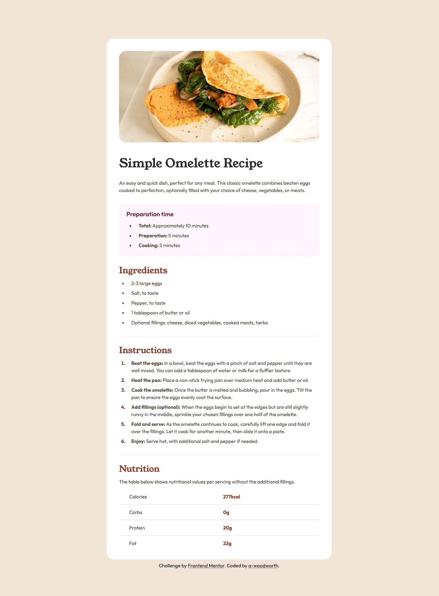
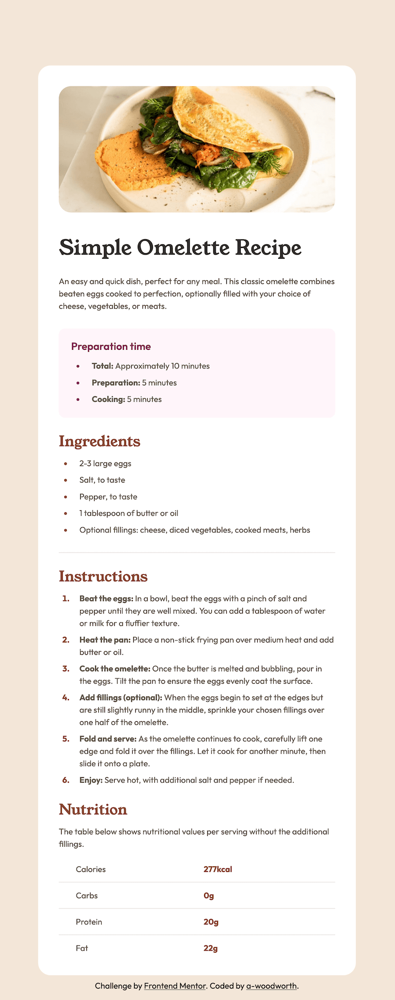
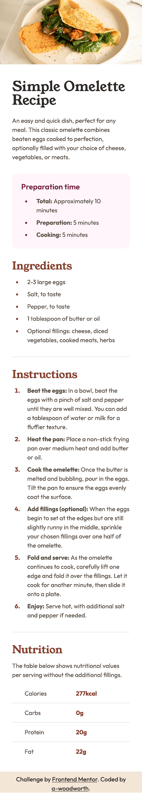

# Frontend Mentor - Recipe Page Solution

This is a solution to the [Recipe page challenge on Frontend Mentor](https://www.frontendmentor.io/challenges/recipe-page-KiTsR8QQKm).

## Table of contents

- [Overview](#overview)
  - [The challenge](#the-challenge)
  - [Screenshots](#screenshots)
  - [Links](#links)
  - [Built with](#built-with)

## Overview

### The challenge

Your challenge is to build out this recipe page and get it looking as close to the design as possible.

### Screenshots

**Desktop**

**Tablet**

**Mobile**

### Links

- Solution URL: [Solution]()
- Live Site URL: [Live Site](https://github.com/a-woodworth/recipe_page)

### Built with

- Semantic HTML5 markup
- CSS Custom properties (variables)
